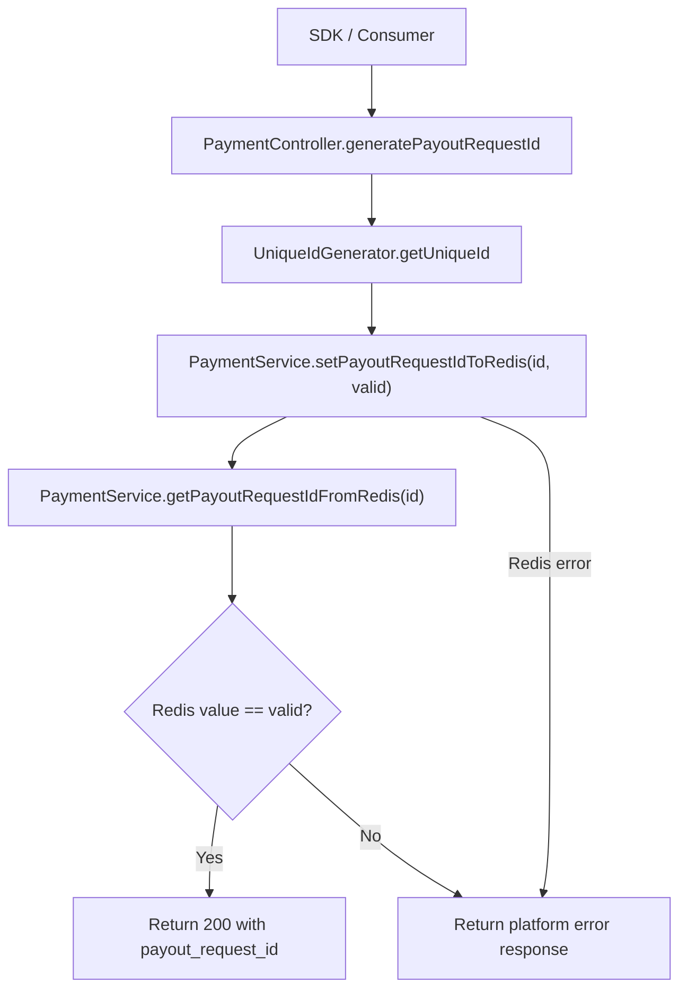
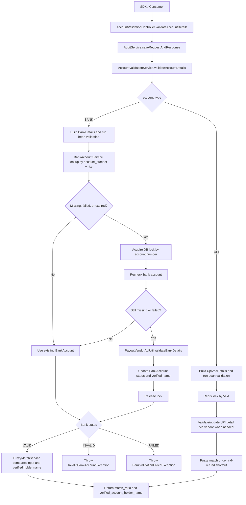
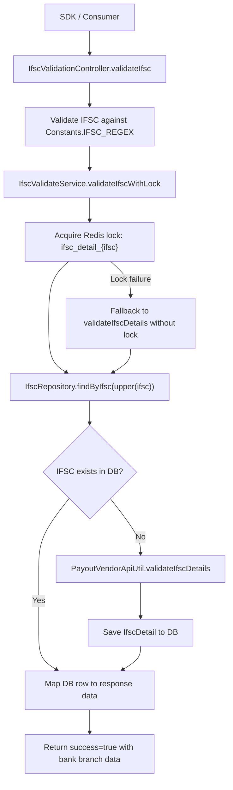
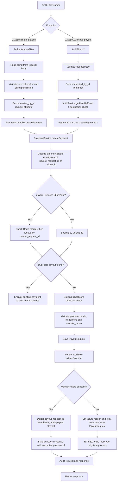
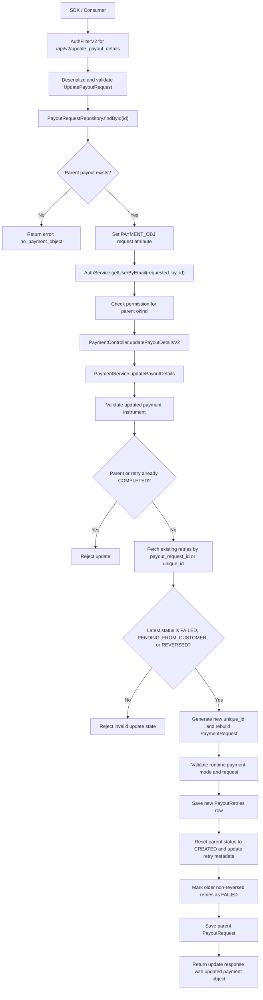
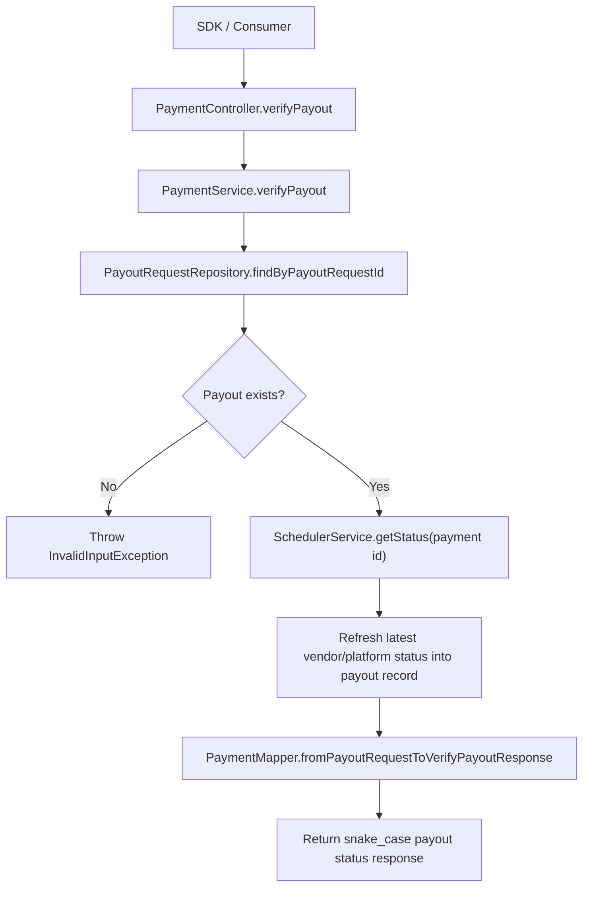

---

## PAYIN SERVICE (`PayinServiceClient`)

**Base URL:** `${acko.payin-service.url}`

### 1. Create Order / Create Payment Order

**Endpoint:** `POST /payments/order-details-ekey`

**Purpose:** Submit a payin order and generate an encrypted key (ekey) for payment processing

**Request DTO: `CreateOrderCentralRequest`**

| Field | Type | Required | Description |
|-------|------|----------|-------------|
| `amount` | Float | ✅ | Payment amount in decimal format (e.g., 1000.50) |
| `client_reference_id` | String | ✅ | Unique reference ID from the client system (used for idempotency and tracking) |
| `customer_id` | Long | ✅ | Unique identifier of the customer/user making the payment |
| `customer_phone` | String | ✅ | Phone number of the customer (e.g., +91XXXXXXXXXX) |
| `customer_email` | String | ✅ | Email address of the customer (fallback: "ecare@acko.tech") |
| `lob` | String | ✅ | Line of Business (e.g., "motor", "health", "electronics") |
| `app` | String | ✅ | Application identifier (e.g., "Acko.Desktop", "Acko.Mobile") |
| `timestamp` | Long | ✅ | Unix timestamp in milliseconds when the order is created |
| `return_url_client` | String | ✅ | Callback URL where the customer is redirected after payment completion |
| `recurring` | Boolean | ❌ | Flag indicating if this is a recurring payment (defaults to false) |
| `context` | Map<String, String> | ❌ | Additional metadata or context data (key-value pairs) |

**Response DTO: `CreateOrderCentralResponse`**

| Field | Type | Description |
|-------|------|-------------|
| `ekey` | String | Encrypted order key - unique identifier for this payment order (use this for further operations) |

**HTTP Response:** `ResponseEntity<CreateOrderCentralResponse>`

**Status Codes:**
- `200 OK` - Order created successfully
- `400 Bad Request` - Invalid request parameters
- `401 Unauthorized` - Authentication failed
- `500 Internal Server Error` - Server error

**Error Handling:** Throws `OrderCreationFailedException` on failure. Implement retry logic with exponential backoff (recommended: 3 retries with 2s, 4s, 8s delays).

---

### 2. Verify Payment (V1)

**Endpoint:** `GET /payments/{orderId}/verify`

**Purpose:** Sync and verify the status of a payin order (legacy version)

**Path Parameters:**

| Parameter | Type | Description |
|-----------|------|-------------|
| `orderId` | String | The order ID or ekey returned from createOrder |

**Response DTO: `PayinVerificationCentralResponse`**

| Field | Type | Description |
|-------|------|-------------|
| `id` | String | Internal payment transaction ID |
| `app` | String | Application identifier |
| `lob` | String | Line of Business |
| `client_id` | String | Client/Partner identifier |
| `client_reference_id` | String | Original reference ID from create order request |
| `customer_id` | String | Customer identifier |
| `customer_email` | String | Customer email address |
| `customer_phone` | String | Customer phone number |
| `amount` | Float | Payment amount |
| `currency` | String | Currency code (e.g., "INR") |
| `pg` | String | Payment Gateway used (e.g., "razorpay", "juspay") |
| `pg_token` | String | Payment gateway authentication token |
| `pg_payment_id` | String | Payment ID from the gateway |
| `pg_response` | String | Full response from payment gateway (JSON string) |
| `status` | PaymentStatus | Payment status enum (e.g., PENDING, SUCCESS, FAILED, REFUNDED) |
| `webhook_status` | String | Status of webhook delivery |
| `payment_method` | String | Payment method used (e.g., "card", "netbanking", "upi") |
| `webhook_event_id` | String | ID of the webhook event |
| `created_on` | String | ISO 8601 timestamp of order creation |
| `updated_on` | String | ISO 8601 timestamp of last update |
| `return_url_client` | String | Client callback URL |
| `webhook_event_name` | String | Name of the webhook event |

**Status Codes:**
- `200 OK` - Payment verified successfully
- `400 Bad Request` - Invalid order ID
- `404 Not Found` - Order not found
- `500 Internal Server Error` - Server error

---

### 3. Verify Payment (V2)

**Endpoint:** `GET /payments/{orderId}/verify/v2`

**Purpose:** Sync and verify the status of a payin order (enhanced version with refund details)

**Path Parameters:**

| Parameter | Type | Description |
|-----------|------|-------------|
| `orderId` | String | The order ID or ekey returned from createOrder |

**Response DTO: `PayinVerificationCentralResponseV2`**

| Field | Type | Description |
|-------|------|-------------|
| `event_name` | String | Event name associated with the payment (e.g., "payment.success", "payment.failed") |
| `date_created` | String | ISO 8601 timestamp of event creation |
| `order_object` | OrderObject | Nested object containing detailed order information (see below) |

**OrderObject Structure:**

| Field | Type | Description |
|-------|------|-------------|
| `customer_phone` | String | Customer phone number |
| `customer_id` | String | Customer identifier |
| `user_ekey` | String | Encrypted user key |
| `customer_email` | String | Customer email address |
| `order_id` | String | Order/payment ID |
| `journey` | String | Payment journey type (e.g., "new_customer", "renewal") |
| `app` | String | Application identifier |
| `pg_payment_id` | String | Payment gateway transaction ID |
| `status` | String | Payment status (e.g., "captured", "failed", "pending") |
| `amount` | String | Payment amount as string |
| `refunds` | List<Refund> | Array of refund objects (see below) |
| `payouts_for_refunds` | List<Object> | Array of payout objects for refunds |
| `payment_method_type` | String | Type of payment method (e.g., "card", "upi") |
| `payment_method` | String | Specific payment method details |
| `payment_created` | String | ISO 8601 timestamp of payment creation |

**Refund Object Structure:**

| Field | Type | Description |
|-------|------|-------------|
| `unique_request_id` | String | Unique refund request identifier |
| `ref` | String | Refund reference number |
| `amount` | Double | Refund amount |
| `created` | String | ISO 8601 timestamp of refund creation |
| `status` | String | Refund status (e.g., "pending", "success", "failed") |
| `error_message` | String | Error message if refund failed |
| `initiated_by` | String | User/system that initiated the refund |

**Status Codes:**
- `200 OK` - Payment verified successfully
- `400 Bad Request` - Invalid order ID
- `404 Not Found` - Order not found
- `500 Internal Server Error` - Server error

---

### 4. Create Refund

**Endpoint:** `POST /refund/create`

**Purpose:** Create a refund intent for an existing payment order

**Request DTO: `CreateRefundRequest`**

| Field | Type | Required | Description |
|-------|------|----------|-------------|
| `order_id` | String | ✅ | The order ID or ekey from createOrder response |
| `amount` | Float | ✅ | Refund amount (should be ≤ original payment amount) |

**Response DTO: `CreateRefundResponse`**

| Field | Type | Description |
|-------|------|-------------|
| `refund_id` | String | Unique identifier for the created refund (use for initiateRefund) |

**HTTP Response:** `ResponseEntity<CreateRefundResponse>`

**Status Codes:**
- `200 OK` - Refund created successfully
- `400 Bad Request` - Invalid order ID or amount
- `404 Not Found` - Order not found
- `422 Unprocessable Entity` - Refund amount exceeds available balance
- `500 Internal Server Error` - Server error

---

### 5. Initiate Refund

**Endpoint:** `POST /refund/initiate`

**Purpose:** Submit/process the refund that was created via createRefund

**Request DTO: `InitiateRefundRequest`**

| Field | Type | Required | Description |
|-------|------|----------|-------------|
| `client_id` | String | ❌ | Client identifier (optional, for audit trail) |
| `payment_id` | String | ❌ | Original payment ID (optional) |
| `pg` | String | ❌ | Payment gateway identifier (optional, e.g., "razorpay") |
| `amount` | Float | ❌ | Refund amount (optional, defaults to created amount) |
| `refund_id` | String | ✅ | Refund ID from createRefund response |

**Response DTO: `InitiateRefundResponse`**

| Field | Type | Description |
|-------|------|-------------|
| `refund_id` | String | Refund identifier |
| `payment_id` | String | Original payment ID |
| `amount` | Float | Refund amount processed |
| `pg_token` | String | Payment gateway authentication token |
| `pg_payment_id` | String | Payment gateway transaction ID |
| `status` | String | Refund status (e.g., "initiated", "processed", "failed") |

**HTTP Response:** `ResponseEntity<InitiateRefundResponse>`

**Status Codes:**
- `200 OK` - Refund initiated successfully
- `400 Bad Request` - Invalid refund ID or parameters
- `404 Not Found` - Refund not found
- `409 Conflict` - Refund already processed
- `500 Internal Server Error` - Server error

**Error Handling:** Throws `RefundInitiationFailedException` on failure. Implement retry logic with exponential backoff.

---

## PAYOUT SERVICE (`PayoutServiceClient`)

**Base URL:** `${acko.payout-service.url}`

Flow diagrams below are based on the payout-service implementation:
`PaymentController`, `AccountValidationController`, `IfscValidationController`,
`AuthenticationFilter`, `AuthFilterV2`, `PaymentService`, `AccountValidationService`,
and `IfscValidateService`.

### 1. Generate Payout Request ID

**Endpoint:** `POST /api/generate_payout_request_id`

**Purpose:** Allocate and generate a unique platform payout request ID

**Service Flow:**



**Request:** Empty body

**Response DTO: `PayOutIdResponseDTO`**

| Field | Type | Description |
|-------|------|-------------|
| `payout_request_id` | String | Unique payout request identifier (use for subsequent payout operations) |

**HTTP Response:** `ResponseEntity<PayOutIdResponseDTO>`

**Status Codes:**
- `200 OK` - Payout request ID generated successfully
- `500 Internal Server Error` - Server error

---

### 2. Validate Account Details (Pre-flight)

**Endpoint:** `POST /api/validate/account_details`

**Purpose:** Pre-flight validation of beneficiary bank account details before initiating payout

**Service Flow:**



**Request DTO: `AccountValidationRequestDTO`**

| Field | Type | Required | Description |
|-------|------|----------|-------------|
| `account_number` | String | ✅ | Bank account number of the beneficiary |
| `ifsc` | String | ✅ for bank accounts | IFSC code of the bank branch |
| `account_holder_name` | String | ✅ | Name of the account holder |
| `vpa` | String | ✅ for UPI | UPI VPA |
| `account_type` | String | ✅ | Account type: `"bank"` or `"upi"` |
| `payout_request_type` | String | ❌ | Payout flow type (e.g., `"auto_claim"`, `"central_refund"`) |

**Response DTO: `AccountValidationResponseDTO`**

| Field | Type | Description |
|-------|------|-------------|
| `match_ratio` | Double | Match ratio between provided and verified holder name |
| `verified_account_holder_name` | String | Account holder name returned by validation |

**HTTP Response:** `ResponseEntity<ValidateAccountDetailsRes>`

**Status Codes:**
- `200 OK` - Validation completed (may be valid or invalid)
- `400 Bad Request` - Missing required fields
- `422 Unprocessable Entity` - Invalid account details format
- `500 Internal Server Error` - Server error

**Error Handling:** Implement retry logic for 5xx errors. On validation failure, log details for manual review.

---

### 3. Verify IFSC Code

**Endpoint:** `GET /api/ifsc-verify?ifsc={ifsc}`

**Purpose:** Validate IFSC (Indian Financial System Code) code

**Service Flow:**



**Query Parameters:**

| Parameter | Type | Required | Description |
|-----------|------|----------|-------------|
| `ifsc` | String | ✅ | 11-character IFSC code (format: FIRST0000001) |

**Response DTO: `IfscVerificationResponseDTO`**

| Field | Type | Description |
|-------|------|-------------|
| `success` | Boolean | Whether IFSC lookup succeeded |
| `data.ifsc` | String | The validated IFSC code |
| `data.name` | String | Name of the bank |
| `data.address` | String | Branch address |
| `data.city` | String | Branch city |
| `data.state` | String | Branch state |

Example response:

```json
{
  "success": true,
  "data": {
    "ifsc": "SBIN0017118",
    "name": "State Bank of India",
    "address": "VILLAGE AND POST KHARGONE,TEHSIL BARELI,DISTT.RAISEN.MADHYA PRADESH 464671",
    "city": "BARELI",
    "state": "MADHYA PRADESH"
  }
}
```

**HTTP Response:** `ResponseEntity<IfscVerificationResponseDTO>`

**Status Codes:**
- `200 OK` - IFSC verification completed
- `400 Bad Request` - Invalid IFSC format
- `404 Not Found` - IFSC not found in database
- `500 Internal Server Error` - Server error

---

### 4. Initiate Payout

**V2 Endpoint:** `POST /api/v2/initiate_payout`

**V1 Endpoint:** `POST /api/initiate_payout/`

SDK mapping:

| SDK method | Platform path |
|------------|---------------|
| `paymentClient.payout().initiate(request)` | `POST /api/v2/initiate_payout` |
| `paymentClient.payout().initiateV1(request)` | `POST /api/initiate_payout/` |

**Purpose:** Submit a payout request to transfer funds to beneficiary

**Service Flow:**



**Request DTO: `InitiatePayoutRequestDTO`**

| Field | Type | Required | Description |
|-------|------|----------|-------------|
| `okind` | String | ✅ | Origin kind/source identifier (e.g., `"work"`, `"jarvis"`, `"firefly"`, `"central_payout"`) |
| `oid` | String | ✅ | Origin ID (e.g., claim ID, policy ID, order ID from source system) |
| `amount` | BigDecimal | ✅ | Payout amount in decimal format |
| `creator_notes` | String | ❌ | Free-form creator notes |
| `entity_type` | String | ✅ | Type of beneficiary entity (e.g., "customer", "vendor", "advisor") |
| `entity_id` | Long | ✅ | Unique numeric identifier of the beneficiary entity |
| `entity_subtype` | String | ❌ | Sub-type of entity (e.g., "individual", "business") |
| `payment_instrument` | PaymentInstrument | ✅ | Beneficiary bank account details (see below) |
| `payment_mode` | String | ✅ | Payment mode: `"bank"`, `"beneficiary_id"`, `"paytm"`, `"upi"`, `"amazon_pay"` |
| `callback_url` | String | ❌ | Webhook URL for payout status notifications |
| `unique_id` | String | ❌ | Unique identifier for idempotency |
| `payment_type` | String | ❌ | Type of payment; defaults to `"claim"` |
| `parent_payment_id` | Long | ❌ | Parent payment ID for tracking retry/refund chains |
| `payment_task_id` | Long | ❌ | Internal payment task identifier |
| `requested_by_id` | String | ❌ | User/system ID requesting the payout |
| `payout_request_id` | String | ❌ | Previously generated payout request ID |
| `payout_lob` | String | ❌ | Payout line of business |

**PaymentInstrument Structure:**

| Field | Type | Required | Description |
|-------|------|----------|-------------|
| `account_number` | String | ✅ | Beneficiary bank account number |
| `ifsc` | String | ✅ for bank accounts | IFSC code of the bank branch |
| `account_holder` | String | ❌ | Account holder name |
| `lob_reference_no` | String | ❌ | LOB reference number; also accepts `claim_number` |
| `user_phone` | String | ❌ | Beneficiary phone |
| `user_email` | String | ❌ | Beneficiary email |
| `input_email` | String | ❌ | Input email |
| `vpa` | String | ✅ for UPI | UPI VPA |
| `transfer_mode` | String | ❌ | Transfer mode; also accepts `transferMode` |

**Response DTO: `InitiatePayoutResponseDTO`**

| Field | Type | Description |
|-------|------|-------------|
| `success` | Boolean | Whether request creation succeeded |
| `result.id` | String | Payment key/id returned by payout-service |
| `result.message` | String | Optional message; may be absent on success |

The SDK DTO also exposes `id` and `message` as convenience fields copied from `result`.

Example response:

```json
{
  "success": true,
  "result": {
    "id": "IVf9t1dr8udGUumUIYAU9g"
  }
}
```

**HTTP Response:** `ResponseEntity<InitiatePayoutResponseDTO>`

**Status Codes:**
- `200 OK` - Payout initiated successfully
- `400 Bad Request` - Invalid request parameters
- `401 Unauthorized` - Authentication failed
- `422 Unprocessable Entity` - Invalid transition or state
- `500 Internal Server Error` - Server error

**Error Handling:** Throws `InvalidTransitionException` for invalid state transitions. Because initiate is money-moving, the SDK does not blindly retry it. On timeout or an uncertain result, consumers should call `verify(payoutRequestId)` using the generated/persisted `payout_request_id`.

---

### 5. Update Payout Details

**Endpoint:** `POST /api/v2/update_payout_details`

**Purpose:** Update payout details after creation (e.g., change amount or beneficiary details)

**Service Flow:**



**Request DTO: `UpdatePayoutRequestDTO`**

| Field | Type | Required | Description |
|-------|------|----------|-------------|
| `id` | Long | ✅ | Numeric payout/payment ID to update; this is not `payout_request_id` |
| `amount` | BigDecimal | ✅ | Updated payout amount |
| `payment_instrument` | PaymentInstrument | ✅ | Updated beneficiary bank account details |
| `requested_by_id` | String | ✅ | User/system ID requesting the update |
| `payment_mode` | String | ❌ | Updated payment mode: `"bank"`, `"beneficiary_id"`, `"paytm"`, `"upi"`, `"amazon_pay"` |
| `callback_url` | String | ✅ | Updated webhook URL for notifications |

**Response DTO: `UpdatePayoutResponseDTO`**

| Field | Type | Description |
|-------|------|-------------|
| `success` | Boolean | Whether update succeeded |
| `result.id` | Long | Payment id |
| `result.oid` | Long | Origin id after decoding |
| `result.okind` | String | Origin kind |
| `result.amount` | String | Updated payout amount |
| `result.status` | String | Updated retry/status value |
| `result.paymentInstrument` | String | Updated payment instrument JSON string |
| `result.paymentMode` | String | Updated payment mode |
| `result.payoutRequestId` | String | Payout request identifier |
| `result.paymentType` | String | Payment type |

**HTTP Response:** `ResponseEntity<UpdatePayoutResponseDTO>`

**Status Codes:**
- `200 OK` - Payout details updated successfully
- `400 Bad Request` - Invalid request parameters
- `404 Not Found` - Payout request not found
- `409 Conflict` - Cannot update in current state
- `500 Internal Server Error` - Server error

---

### 6. Verify/Check Payout Status

**Endpoint:** `GET /api/{payout_request_id}/verify`

**Purpose:** Sync payout status and verification details

**Service Flow:**



**Path Parameters:**

| Parameter | Type | Description |
|-----------|------|-------------|
| `payout_request_id` | String | The payout request ID generated by `POST /api/generate_payout_request_id` and persisted before/at initiate |

**Response DTO: `PayoutStatusDTO`**

| Field | Type | Description |
|-------|------|-------------|
| `oid` | Long | Origin id after decoding |
| `okind` | String | Origin kind |
| `payout_request_id` | String | Payout request identifier |
| `status` | String | Current payout status (e.g., `"created"`, `"initiated"`, `"completed"`, `"failed"`, `"rejected"`) |
| `amount` | BigDecimal | Payout amount |
| `created_on` | String | Creation timestamp |
| `updated_on` | String | Last update timestamp |
| `requested_by_id` | String | User/system ID that requested payout |
| `creator_notes` | String | Creator notes |
| `payment_instrument` | Object | Payment instrument object |
| `payment_mode` | String | Payment mode |
| `payment_type` | String | Payment type |
| `failure_reason` | String | Failure reason if payout failed |
| `source` | String | Payout source |
| `utr` | String | UTR/reference from payment rails |
| `retry_flag` | String | Retry eligibility/status flag |

**HTTP Response:** `ResponseEntity<PayoutStatusDTO>`

**Status Codes:**
- `200 OK` - Status retrieved successfully
- `400 Bad Request` - Invalid payout request ID
- `404 Not Found` - Payout request not found
- `500 Internal Server Error` - Server error

---

## SDK Implementation Recommendations

### Authentication & Authorization
- Payout APIs require the internal payout cookie via the `Cookie` header, for example `internalPayoutCookie=...`
- S2S bearer token management is for payin/future APIs, not payout
- Include request signing for sensitive operations

### Retry Strategy
```
Max Retries: 3
Backoff Strategy: Exponential (2s, 4s, 8s)
Idempotency: Use unique_id or client_reference_id to prevent duplicate processing
Timeout: 30 seconds per request
```

### Error Handling
- Implement specific exception classes for each error type
- Log detailed error messages with trace IDs for debugging
- Provide user-friendly error messages to clients

### Rate Limiting
- Implement client-side rate limiting (requests/minute)
- Respect server rate limit headers (X-RateLimit-*)
- Queue requests during rate limit windows

### Request/Response Logging
- Log all requests with sanitized sensitive data (mask card numbers, account numbers)
- Include correlation IDs for distributed tracing
- Store logs for compliance and audit purposes

### Webhook Management
- Implement webhook signature verification
- Store webhook payloads for reconciliation
- Implement retry logic for webhook processing failures

---
