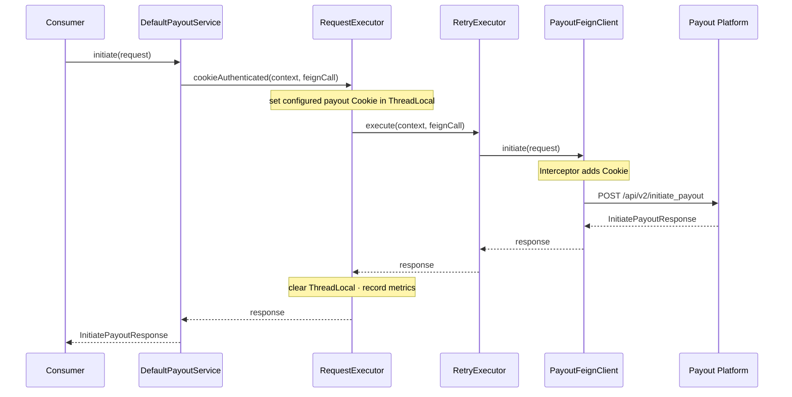
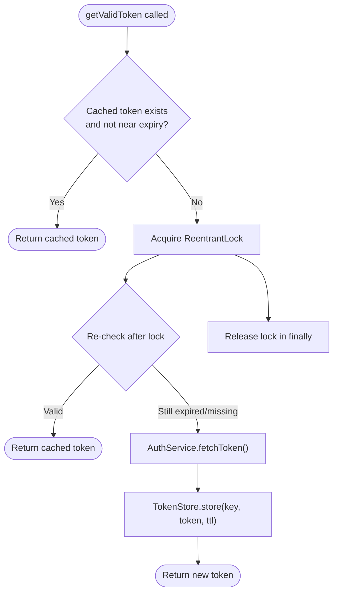
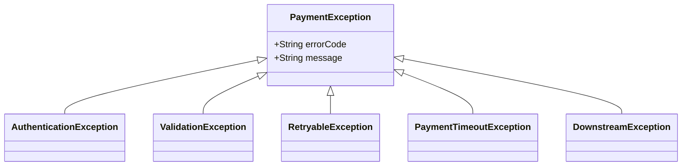
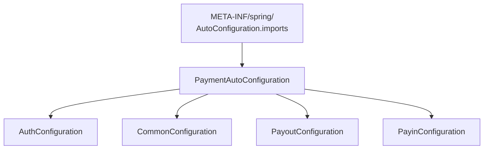

# Payment SDK — Low-Level Design (LLD)

## Package Structure

Repository modules:

```
acko-payments-sdk/
├── acko-payments-sdk-core     → published SDK jar
└── acko-payments-sdk-example  → local Spring Boot testing app, skipped during deploy
```

Core package structure:

```
com.acko.payment.sdk
├── api/            → PaymentClient, PayoutOperations (PayinOperations post-v0)
├── auth/           → TokenManager, TokenStore, AuthService, OAuthToken
├── cache/          → Reserved for shared/cache adapters (v0 uses InMemoryTokenStore)
├── common/         → RequestExecutor, RetryExecutor, ExceptionMapper, FeignInterceptor
├── config/         → Framework-neutral SdkConfig + timeout/retry/auth settings
├── factory/        → PaymentClientFactory (non-Spring entry)
├── spring/         → PaymentProperties, PaymentAutoConfiguration (Spring-only)
├── events/         → Optional hooks / constants related to payment events (no SQS listeners)
├── exception/      → SDK exception hierarchy
├── model/          → Shared value objects (Money, PaymentStatus, PaymentMode)
├── payin/          → Reserved for payin + refund models (post-v0)
├── payout/         → Payout models, PayoutFeignClient, DefaultPayoutService
└── util/           → MaskingUtils, CorrelationIdHolder
```

> Core packages must remain Spring-free. Spring types live only under `spring/`.

> Payin/refund request/response models will live under `payin/` and be exposed through `PayinOperations` after v0.

---

## Layer Responsibilities

| Layer | Classes | Rule |
|---|---|---|
| **Public API** | `PaymentClient`, `PayoutOperations` | Interface only in v0 |
| **Service** | `DefaultPayoutService` | API → `RequestContext` + Feign call |
| **Infrastructure** | `RequestExecutor`, `RetryExecutor`, `ExceptionMapper` | Cross-cutting concerns |
| **Auth** | `CookieHolder`, `TokenManager`, `TokenStore`, `AuthService` | Payout Cookie lifecycle + future S2S token lifecycle |
| **Feign** | `PayoutFeignClient` | HTTP mapping only; package-private |
| **Config** | `PaymentProperties`, `ConfigResolver` | Hierarchical config |

---

## Public Operations

### `PayoutOperations`
- `generatePayoutRequestId() → GeneratePayoutRequestIdResponse`
- `verifyIfsc(String ifsc) → VerifyIfscResponse`
- `validateAccountDetails(ValidateAccountDetailsRequest) → ValidateAccountDetailsResponse`
- `initiate(InitiatePayoutRequest) → InitiatePayoutResponse`
- `initiateV1(InitiatePayoutRequest) → InitiatePayoutResponse`
- `updatePayoutDetails(UpdatePayoutDetailsRequest) → UpdatePayoutDetailsResponse`
- `verify(String payoutRequestId) → VerifyPayoutResponse`

### `PayinOperations` (post-v0 target)
- `createOrder(CreateOrderRequest) → CreateOrderResponse`
- `verify(String orderId) → VerifyPayinResponse`
- `verifyV2(String orderId) → VerifyPayinResponse`
- `createRefund(CreateRefundRequest) → CreateRefundResponse`
- `initiateRefund(InitiateRefundRequest) → InitiateRefundResponse`

---

## Feign Mapping

### `PayoutFeignClient`
| Operation | HTTP | Path |
|---|---|---|
| initiate | POST | `/api/v2/initiate_payout` |
| initiateV1 | POST | `/api/initiate_payout/` |
| updatePayoutDetails | POST | `/api/v2/update_payout_details` |
| validateAccountDetails | POST | `/api/validate/account_details` |
| verifyIfsc | GET | `/api/ifsc-verify` |
| verify | GET | `/api/{payout_request_id}/verify` |
| generatePayoutRequestId | POST | `/api/generate_payout_request_id` |

### `PayinFeignClient` (post-v0 target)
| Operation | HTTP | Path |
|---|---|---|
| createOrder | POST | `/payments/order-details-ekey` |
| verify | GET | `/payments/{orderId}/verify` |
| verifyV2 | GET | `/payments/{orderId}/verify/v2` |
| createRefund | POST | `/refund/create` |
| initiateRefund | POST | `/refund/initiate` |

---

## Request Execution Flow



Payin/refund will follow the same path post-v0 via `DefaultPayinService` → `PayinFeignClient` → payin/refund platform endpoints.

---

## Token Management Flow



`refreshBuffer` (default 30s) refreshes before expiry. Lock prevents thundering herd.

---

## Retry Policy

- Spring Retry `RetryTemplate`
- Retry on `RetryableException` (5xx, network, timeouts)
- No retry on 4xx
- Configurable: `max-attempts`, `backoff`, `enabled`

---

## Exception Hierarchy



`RetryableException` is internal; after retries exhaust it becomes `DownstreamException`.

---

## Configuration Precedence

```
payment.payout.timeout.read = 10s   ← highest (service-level)
payment.defaults.timeout.read = 5s  ← fallback
SDK hardcoded default = 5s          ← lowest
```

Refund calls use **`payment.payin`** timeouts/retry (same Feign client).

---

## Thread Safety

| Concern | Mechanism |
|---|---|
| Token refresh | `ReentrantLock` + double-checked locking |
| Token → Feign | `ThreadLocal`, cleared in `finally` |
| Concurrent calls | Per-thread `ThreadLocal` slot |

---

## Visibility Rules

| Class Type | Visibility |
|---|---|
| `PaymentClient`, `PayoutOperations`, payout request/response models, exceptions | `public` in v0 |
| `PayinOperations`, payin/refund request/response models | `public` post-v0 target |
| Default services, Feign clients, token internals | `package-private` |

---

## Auto-Configuration



No `@Enable*` annotation required. Consumer adds dependency + config only.
