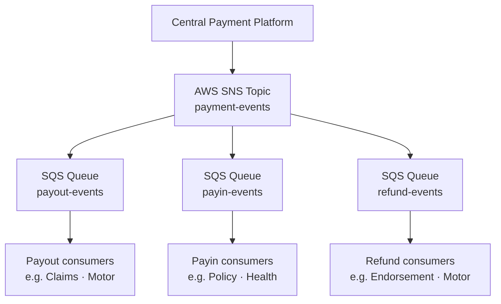

# Payment SDK — Event Contract

## Overview

The SDK does **not** manage asynchronous payment status updates.

Payment lifecycle events are delivered by the Central Payment Platform through a centralized **SNS → SQS** architecture. Services subscribe to the relevant SQS queue independently.

---

## Event Architecture



---

## Event Types

| Event Type | Trigger | Related sync API |
|---|---|---|
| `PAYOUT_INITIATED` | Payout accepted after initiate | `POST /api/v2/initiate_payout` |
| `PAYOUT_PROCESSING` | Payout in flight | — |
| `PAYOUT_SUCCESS` | Settled to beneficiary | confirm with `GET /api/{payout_request_id}/verify` if needed |
| `PAYOUT_FAILED` | Rejected / bounced | same |
| `PAYIN_ORDER_CREATED` | Order/ekey created | `POST /payments/order-details-ekey` |
| `PAYIN_SUCCESS` | Customer payment received | `GET .../verify` or `.../verify/v2` |
| `PAYIN_FAILED` | Failed / expired | same |
| `REFUND_CREATED` | Refund create succeeded | `payin().createRefund` → `POST /refund/create` |
| `REFUND_INITIATED` | Refund initiate submitted | `payin().initiateRefund` → `POST /refund/initiate` |
| `REFUND_SUCCESS` | Refund settled | events (no dedicated refund verify API today) |
| `REFUND_FAILED` | Refund rejected | events |

---

## Event Envelope (Planned)

> Full schema TBD with Central Payment Platform.

```json
{
  "event_id": "uuid",
  "event_type": "PAYOUT_SUCCESS",
  "transaction_id": "platform-transaction-id",
  "payout_request_id": "payout-request-id",
  "order_id": "payin-order-id",
  "reference_id": "consumer-business-reference",
  "status": "SUCCESS",
  "occurred_at": "2024-01-01T10:00:00Z",
  "payload": {}
}
```

Correlation guidance:
- Payout flows: prefer `payout_request_id` + `reference_id`
- Payin flows: prefer `order_id` + `reference_id`
- Refund flows: prefer refund id from create response + original `order_id`

---

## Consumer Responsibilities

1. Subscribe to the relevant SQS queue  
2. Process events **idempotently**  
3. Correlate using platform ids + your `reference_id`  
4. Do not embed SQS listeners inside the Payment SDK  

---

## Synchronous vs Asynchronous

| Approach | API / channel | When to use |
|---|---|---|
| Sync verify (payout) | `payout().verify(payoutRequestId)` | Timeout recovery, immediate UI check |
| Sync verify (payin) | `payin().verify` / `verifyV2` | Callback confirmation, recovery |
| Async events | SNS → SQS | Final state transitions / workflows |

Recommended pattern: **events drive the workflow; verify APIs recover from ambiguity** (timeouts, missed callbacks).
