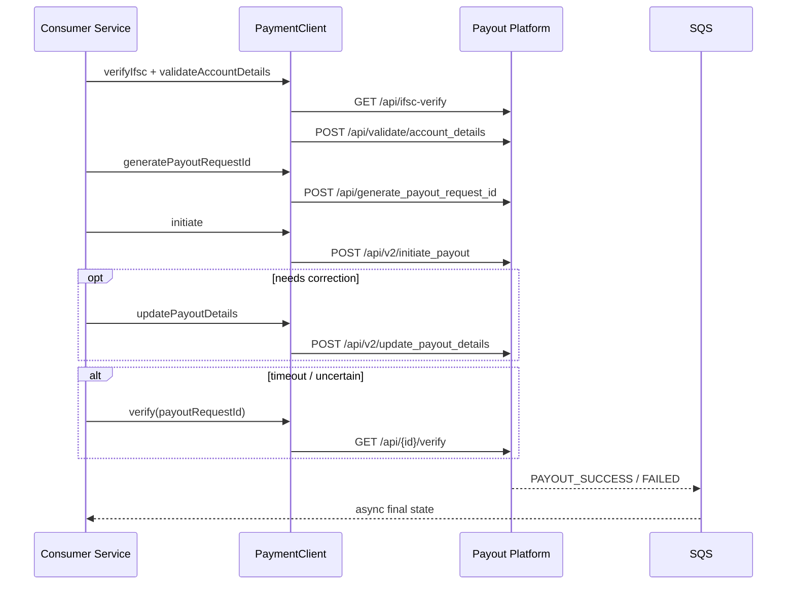
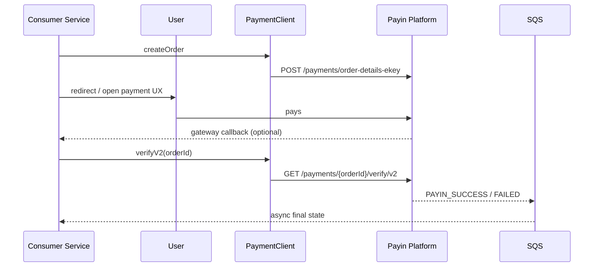
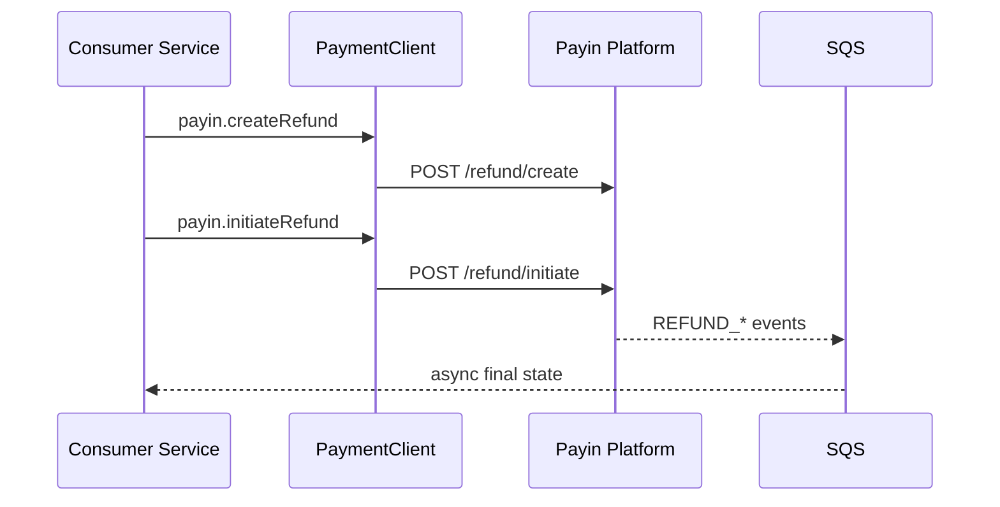

# Payment SDK — Design Recommendations

Design guidance for the consumer-facing SDK. Start from how teams will use it, then derive internals.

Related: [04-integration-guide.md](./04-integration-guide.md), [02-api-contracts.md](./02-api-contracts.md)

---

## 1. Design principle: mirror the platform

Public API has exactly two surfaces — same as the platform:

```text
Consumer mental model          Platform reality
─────────────────────          ────────────────
payout()                  →    PayoutServiceClient
payin()                   →    PayinServiceClient
                             (orders · verify · refund)
```

Do **not** add `paymentClient.refund()`.  
Do **not** invent a third Feign client or `payment.refund.base-url`.

---

## 2. Recommended public API shape

```text
PaymentClient
├── payout()  → PayoutOperations
│     ├── generatePayoutRequestId(...)
│     ├── verifyIfsc(...)
│     ├── validateAccountDetails(...)
│     ├── initiate(...)
│     ├── updatePayoutDetails(...)
│     └── verify(payoutRequestId)
│
└── payin()   → PayinOperations
      ├── createOrder(...)          // order-details-ekey
      ├── verify(orderId)           // legacy
      ├── verifyV2(orderId)         // preferred for new products
      ├── createRefund(...)
      └── initiateRefund(...)
```

### Why this shape

| Choice | Rationale |
|---|---|
| Single `PaymentClient` | One bean to inject; easy discovery |
| Only `payout()` + `payin()` | 1:1 with platform clients |
| Refund under `payin()` | Matches `PayinServiceClient` ownership |
| Explicit `verify` / `verifyV2` | Matches platform; no silent version switching |
| Validation helpers on payout | Encourages safe pre-flight before money movement |
| No async poller in SDK | Keeps SDK stateless; events stay outside |

---

## 3. Recommended user journeys

### Journey A — Payout (Claims / disbursal)



**Integrator rules**
1. Validate before initiate  
2. Persist `payout_request_id` + your `reference_id` before/at initiate  
3. On timeout → `verify`, never blind retry of initiate unless platform guarantees idempotency  
4. Drive business completion from SQS

### Journey B — Payin (Policy / premium collection)



**Integrator rules**
1. New products use `verifyV2`  
2. Callback ≠ final truth; confirm with verify and/or event  
3. Store `order_id` + `reference_id` immediately after create

### Journey C — Refund (via payin)



**Integrator rules**
1. Always `createRefund` then `initiateRefund`  
2. Persist refund id from create before initiate  
3. No dedicated refund verify API today → rely on events

---

## 4. Alternatives considered

### Option A — Mirror platform (recommended)
Only `payout()` and `payin()`, with refund methods on `PayinOperations`.

**Pros:** 1:1 with platform, no fake third capability  
**Cons:** refunds are not a top-level entry (acceptable — they are payin APIs)

### Option B — Separate `refund()` facade
`PaymentClient.refund()` over the same Payin Feign client  

**Reject for this SDK:** diverges from platform mental model (`PayoutServiceClient` / `PayinServiceClient` only)

### Option C — Three base URLs  
**Reject:** invents a refund service that does not exist operationally

---

## 5. Naming recommendations

| Prefer | Avoid |
|---|---|
| `createOrder` for `/payments/order-details-ekey` | Exposing `orderDetailsEkey` as the primary name |
| `verify` / `verifyV2` | Hiding v1/v2 behind one method with a flag |
| `createRefund` / `initiateRefund` on `payin()` | `paymentClient.refund()` |
| `validateAccountDetails` | Generic `validate(...)` |
| `generatePayoutRequestId` | `generateId()` |
| `payoutRequestId` in models | Overloading `transactionId` for multiple concepts |

Alias note: if platform naming must appear for searchability, keep it in Javadoc (`Maps to POST /payments/order-details-ekey`), not in the primary method name.

---

## 6. Idempotency & timeout design (SDK contract)

| Operation | Blind retry safe? | Recovery |
|---|---|---|
| `verifyIfsc` / `validateAccountDetails` | Yes (read/validate) | Re-call |
| `generatePayoutRequestId` | Only if platform is idempotent on reference | Prefer store id once |
| `initiate` payout | **No** unless idempotency key exists | `verify(payoutRequestId)` |
| `updatePayoutDetails` | Conditional | `verify` |
| `createOrder` | **No** by default | Product-specific; avoid duplicate orders |
| `verify` / `verifyV2` | Yes | Re-call |
| `createRefund` / `initiateRefund` | **No** by default | Events + stored refund id |

If the platform supports idempotency keys, the SDK requests should expose an optional `idempotency_key` field and propagate it consistently.

---

## 7. Config design

```yaml
payment:
  auth: { ... }
  defaults: { timeout, retry }
  payout: { base-url, timeout?, retry? }
  payin:  { base-url, timeout?, retry? }   # includes refund endpoints
```

Do not add `payment.refund.*`.

---

## 8. Package / module design

- Refund models live in the `payin` package  
- Refund methods live on `PayinOperations` / `DefaultPayinService`  
- One Feign interface per platform service  
- Shared `RequestExecutor` pipeline for all calls  

---

## 9. What to optimize for first

1. **Payout happy path + verify recovery** (highest misuse risk: double payout)  
2. **Payin createOrder + verifyV2**  
3. **Payin createRefund → initiateRefund**  
4. Validation helpers (`ifsc`, account details)  
5. Metrics / advanced observability  

---

## 10. Decision summary

| Decision | Recommendation |
|---|---|
| Entry point | Single `PaymentClient` |
| Public grouping | `payout()` / `payin()` only |
| Refund API | `payin().createRefund` / `payin().initiateRefund` |
| HTTP clients | Payout + Payin only |
| Status model | Sync verify for recovery; SQS for final state |
| Versioned verify | Explicit `verify` and `verifyV2` methods |
| Scope boundary | No business workflows, no SQS listeners inside SDK |

Adopt this before coding the public interfaces so consumer examples in the integration guide stay stable.
