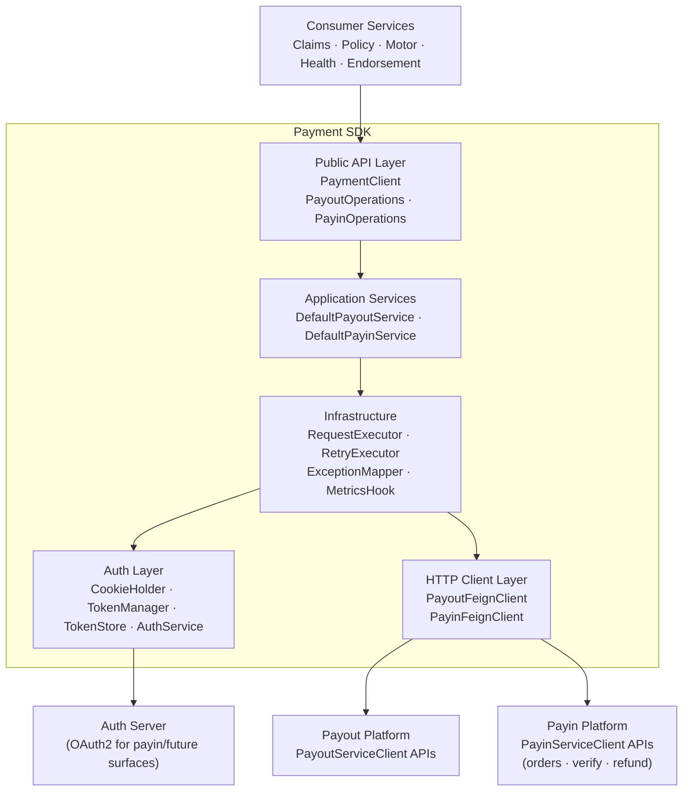
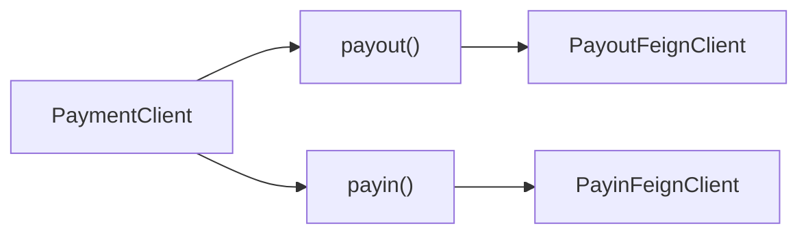
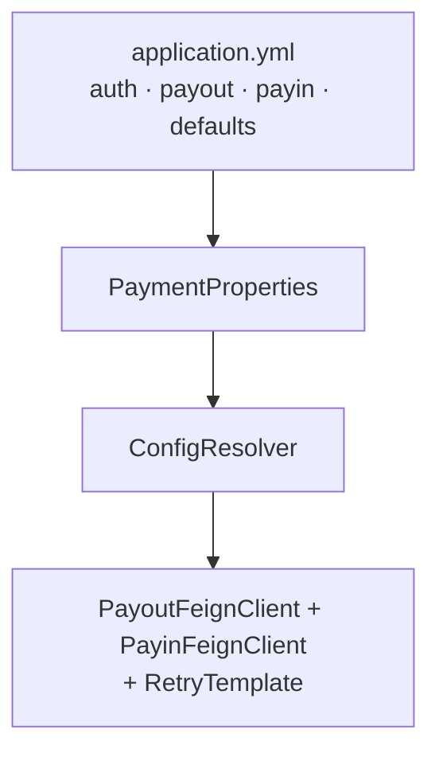
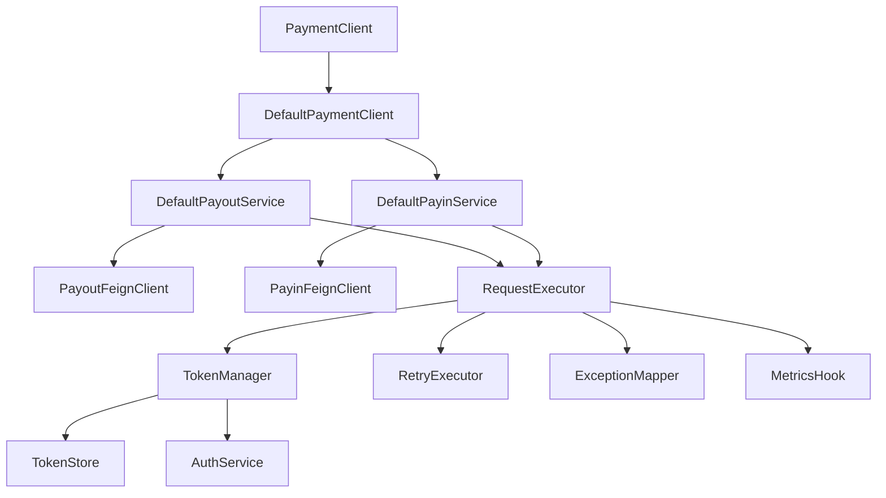

# Payment SDK — Architecture

## High-Level Architecture

---

## Public API vs Platform Clients

Public API mirrors the two platform clients exactly:

| Public API | Feign client | Platform base URL |
|---|---|---|
| `PayoutOperations` | `PayoutFeignClient` | `payment.payout.base-url` |
| `PayinOperations` | `PayinFeignClient` | `payment.payin.base-url` |

Refund endpoints (`/refund/create`, `/refund/initiate`) belong to **PayinOperations** / `PayinFeignClient`.  
There is **no** `refund()` facade and **no** `payment.refund.base-url`.

---

## Component Overview

### Public API Layer
- `PaymentClient` — single entry point
- `PayoutOperations`, `PayinOperations` — the only two operation interfaces
- Interfaces only; no HTTP/auth details exposed

### Application Services
- `DefaultPayoutService`, `DefaultPayinService`
- Map method → `RequestContext` + Feign call
- No auth/retry/logging logic inside services

### Infrastructure Layer
- `RequestExecutor` — full request lifecycle
- `RetryExecutor` — Spring Retry policy
- `ExceptionMapper` — Feign → SDK exceptions
- `MetricsHook` — pluggable metrics

### Auth Layer
- `CookieHolder`, `TokenManager`, `TokenStore`, `AuthService`
- Hidden from consumers; payout uses the configured Cookie header, while S2S bearer tokens are retained for payin/future surfaces

### HTTP Client Layer
- Package-private Feign clients only
- `PaymentFeignInterceptor` adds request-scoped auth headers: `Cookie` for payout, `Authorization` for S2S bearer-token surfaces
- One Feign client per platform service (Payout, Payin)

---

## Endpoint Ownership

### PayoutFeignClient
| Method | Path |
|---|---|
| POST | `/api/v2/initiate_payout` |
| POST | `/api/initiate_payout/` |
| POST | `/api/v2/update_payout_details` |
| POST | `/api/validate/account_details` |
| GET | `/api/ifsc-verify?ifsc={ifsc}` |
| GET | `/api/{payout_request_id}/verify` |
| POST | `/api/generate_payout_request_id` |

### PayinFeignClient
| Method | Path |
|---|---|
| POST | `/payments/order-details-ekey` |
| GET | `/payments/{orderId}/verify` |
| GET | `/payments/{orderId}/verify/v2` |
| POST | `/refund/create` |
| POST | `/refund/initiate` |

---

## Key Design Decisions

**Why only `payout()` and `payin()`?**  
That matches the platform: `PayoutServiceClient` and `PayinServiceClient`. Refunds are payin APIs, so they stay on `payin()`.

**Why only two Feign clients?**  
Same reason — accurate ownership, less config, fewer timeouts to tune.

**Why core Feign instead of Spring Cloud OpenFeign?**  
Programmatic setup, per-client timeouts, no classpath scanning, no Spring Cloud dependency.

**Why thread-local for token propagation?**  
Keeps Feign interfaces clean. Executor sets token, interceptor reads it, executor clears it in `finally`.

**Why RestTemplate for auth, Feign for payment APIs?**  
Auth is one form-encoded token endpoint; RestTemplate avoids a form-encoder dependency for that single call.

**Why package-private implementations?**  
Small, intentional public surface. Consumers cannot couple to internals.

---

## Configuration Flow

---

## Dependency Flow

